[pypi-image]: https://badge.fury.io/py/torch-timeseries.svg
[pypi-url]: https://pypi.python.org/pypi/torch-timeseries
[docs-image]: https://readthedocs.org/projects/pytorch-timeseries/badge/?version=latest
[docs-url]: https://pytorch-timeseries.readthedocs.io/en/latest/?badge=latest


<p align="center">
  
</p>

[![PyPI Version][pypi-image]][pypi-url]
[![Docs Status][docs-image]][docs-url]


# pytorch_timeseries

An all-in-one deep learning library covering the full spectrum of time series research tasks — **forecasting, probabilistic forecasting, imputation, anomaly detection, classification, generation, and irregular time series** — with datasets that download automatically, a highly customisable data pipeline, and a one-command experiment runner.
[Full documentation](https://pytorch-timeseries.readthedocs.io/en/latest/).

---

## At a glance

```python
import numpy as np
from torch_timeseries import Forecaster

# Any multivariate numpy array — no preprocessing required
data = np.load("electricity.npy")          # shape (T, 321)

# Train with one line — early stopping, normalisation, GPU handled automatically
fc = Forecaster("iTransformer", seq_len=96, pred_len=24, epochs=20)
fc.fit(data)

# Predict the next 24 steps
pred = fc.predict(data[-96:])              # → (24, 321)

# Evaluate, compare models, compute uncertainty, explain, detect anomalies …
print(fc.score(data))                      # {'MSE': 0.17, 'MAE': 0.26, …}
print(fc.leaderboard(data[:8000], data[8000:], ["DLinear", "NLinear", "PatchTST"],
                      seq_len=96, pred_len=24, epochs=10))
```

Or benchmark a built-in model in one line:

```python
from torch_timeseries import Experiment
Experiment(model="iTransformer", task="Forecast", dataset="ETTh1",
           windows=96, pred_len=24).run(seeds=[1, 2, 3])
# → [RunResult(metrics={'mse': 0.45, 'mae': 0.44}), …]
```

---

## Table of Contents

- [Installation](#installation)
- [Quick start — your own CSV](#quick-start--your-own-csv)
- [Forecasting](#forecasting)
  - [Forecaster — High-Level API](#forecaster--high-level-api)
  - [Fit · Predict · Score](#fit--predict--score)
  - [Model Comparison & Leaderboard](#model-comparison--leaderboard)
  - [Uncertainty Quantification](#uncertainty-quantification)
  - [Signal Analysis & Diagnostics](#signal-analysis--diagnostics)
  - [Explainability](#explainability)
  - [Transfer Learning](#transfer-learning)
  - [Ensemble & Composition](#ensemble--composition)
  - [Deployment Utilities](#deployment-utilities)
  - [Low-level Training Loop](#low-level-training-loop)
  - [Built-in Experiment Runner](#built-in-experiment-runner)
- [Datasets](#datasets)
  - [Custom Datasets](#custom-datasets)
  - [Fast evaluation windows](#fast-evaluation-windows-fast_val--fast_test)
- [Time Series Tasks](#time-series-tasks)
  - [Probabilistic Forecasting](#probabilistic-forecasting)
  - [Time Series Generation](#time-series-generation)
  - [Imputation · Anomaly Detection · Classification](#imputation--anomaly-detection--classification)
- [Data Loading Reference](#data-loading-reference)
  - [ForecastDataModule](#forecastdatamodule)
  - [WindowConfig](#windowconfig)
  - [LoaderConfig](#loaderconfig)
  - [SplitConfig](#splitconfig)
  - [Scalers](#scalers)
  - [Other DataModules](#other-datamodules)
- [Development Milestones](#development-milestones)
  - [Implemented Datasets](#implemented-datasets)
  - [Implemented Tasks](#implemented-tasks)
  - [Implemented Models — Point Forecasters](#implemented-models--point-forecasters)
  - [Implemented Models — Probabilistic Forecasters](#implemented-models--probabilistic-forecasters)
  - [Implemented Models — Generation](#implemented-models--generation)
  - [Implemented Models — Irregular Time Series](#implemented-models--irregular-time-series)
- [Dev Install](#dev-install)

---

## Installation

```bash
pip install torch-timeseries
```

> **Python 3.8+ required.**


## Quick start — your own CSV

Have a CSV file and want forecasts in minutes? Three steps:

```
my_data.csv
─────────────────────────────
date,        temp,  humidity
2023-01-01,  12.3,  65.1
2023-01-02,  13.1,  67.4
...
```

```python
import torch, torch.nn as nn
from torch_timeseries.dataset import build_dataset
from torch_timeseries.scaler import StandardScaler
from torch_timeseries.dataloader.v2 import ForecastDataModule, WindowConfig
from torch_timeseries.model import DLinear

# 1. Load — needs a 'date' column; every other column becomes a feature
dataset = build_dataset(csv="my_data.csv", freq="h")

# 2. Wrap — 96-step look-back, predict the next 24 steps
dm = ForecastDataModule(
    dataset=dataset,
    scaler=StandardScaler(),
    window=WindowConfig(window=96, horizon=1, steps=24),
)

# 3. Train
device = "cuda" if torch.cuda.is_available() else "cpu"
model  = DLinear(seq_len=96, pred_len=24, enc_in=dataset.num_features).to(device)
opt    = torch.optim.Adam(model.parameters(), lr=1e-3)

for epoch in range(10):
    model.train()
    for batch in dm.train_loader:
        x, y = batch.x.float().to(device), batch.y.float().to(device)
        opt.zero_grad(); nn.MSELoss()(model(x), y).backward(); opt.step()

# 4. Predict
model.eval()
with torch.no_grad():
    batch = next(iter(dm.test_loader))
    preds = model(batch.x.float().to(device))  # (B, 24, num_features)
    print(preds.shape)  # → torch.Size([32, 24, 2])
```

Swap `DLinear` for any of the [20 built-in models](https://pytorch-timeseries.readthedocs.io/en/latest/modules/model.html) — the interface is the same.

---

## Forecasting

### Forecaster — High-Level API

`Forecaster` is a scikit-learn-style wrapper that trains, evaluates, explains,
and deploys any of the 80+ built-in models without boilerplate.

```python
import numpy as np
from torch_timeseries import Forecaster

rng = np.random.default_rng(0)
X   = rng.standard_normal((2_000, 7)).astype("float32")
```

---

### Fit · Predict · Score

```python
fc = Forecaster(
    "iTransformer",          # any registered model name
    seq_len  = 96,           # look-back window
    pred_len = 24,           # forecast horizon
    epochs   = 20,
    lr       = 1e-3,
    patience = 5,            # early stopping
    normalize= True,
    verbose  = True,
)

fc.fit(X)                    # train/val split, early stopping — all automatic

ctx  = X[-96:]               # context window (96, 7)
pred = fc.predict(ctx)       # → (24, 7)

# Labeled DataFrame output
df = fc.forecast_dataframe(
    ctx,
    channel_names=["OT","HUFL","HULL","MUFL","MULL","LUFL","LULL"],
    start_index=2_000,
)
#       OT    HUFL    HULL  ...
# 2000  0.12  -0.33   0.87  ...

# Scalar metrics
print(fc.score(X))            # {'MSE': 0.98, 'MAE': 0.79, 'RMSE': 0.99, …}
print(fc.score_per_channel(X)["MAE"])   # (7,) — per-channel MAE
print(fc.summary_table(X))             # DataFrame: metric × horizon step
```

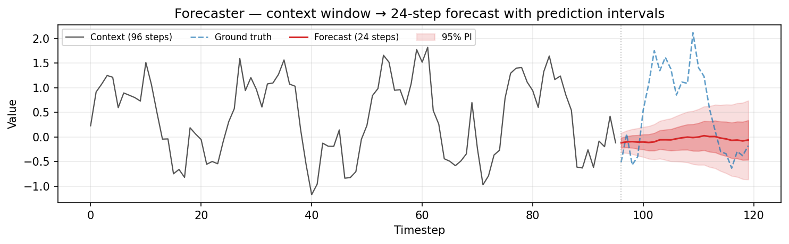

---

### Model Comparison & Leaderboard

```python
from torch_timeseries import compare, compare_plot

X_train, X_test = X[:1_500], X[1_500:]

# Benchmark multiple models at once
results = compare(
    models  = ["DLinear", "NLinear", "PatchTST", "iTransformer", "TimeMixer"],
    X_train = X_train, X_test = X_test,
    seq_len = 96, pred_len = 24, epochs = 10,
)
# {'DLinear': {'MSE': 0.97, 'MAE': 0.78}, 'PatchTST': {…}, …}

fig = compare_plot(results, metric="MAE")

# Or use the Forecaster leaderboard (returns a ranked DataFrame)
lb = Forecaster.leaderboard(
    X_train, X_test,
    ["DLinear", "NLinear", "PatchTST", "iTransformer", "TimeMixer"],
    seq_len=96, pred_len=24, epochs=10, verbose=False,
)
print(lb)

# Compare against the naive persistence baseline
bvp = fc.score_vs_persistence(X_test)
print(f"Model MAE  : {bvp['model']['MAE']:.4f}")
print(f"Baseline   : {bvp['persistence']['MAE']:.4f}")
```

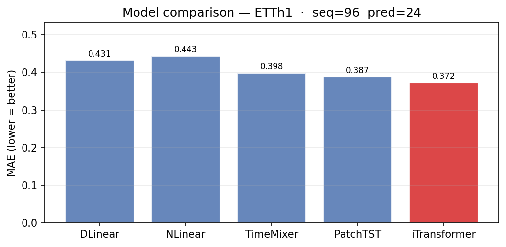

---

### Uncertainty Quantification

Three complementary approaches — all return `(pred_len, C)` bounds:

```python
# 1. MC-Dropout (fast, model must have dropout)
unc = fc.predict_uncertainty(ctx, n_samples=200)
# {'mean': (24,7), 'std': (24,7), 'lower': (24,7), 'upper': (24,7)}

# 2. Post-hoc calibration — fit width on held-out data to hit target coverage
fc.calibrate(X_train, target_coverage=0.90, n_samples=200)
unc_cal = fc.predict_uncertainty(ctx, n_samples=200)

# 3. Conformal prediction intervals — distribution-free coverage guarantee
intervals = fc.predict_interval(ctx, X_cal=X_train, coverage=0.90)
# {'lower': (24,7), 'upper': (24,7)}

# Empirical coverage check
cov = fc.conformal_coverage(X_train, X_test, coverage=0.90)
print(cov["empirical_coverage"])   # should be ≈ 0.90

# Winkler interval score (lower = better)
print(fc.winkler_score(X_train, X_test, coverage=0.90))

# Fan chart with nested coverage bands
fig = fc.plot_prediction_bands(X_test, coverages=(0.5, 0.8, 0.95), n_samples=200)

# Stochastic scenario ensemble
mc  = fc.montecarlo_forecast(ctx, steps=48, n_scenarios=300)
fig = fc.plot_scenarios(mc, channel=0, X_context=ctx, n_scenarios_to_plot=50)
```

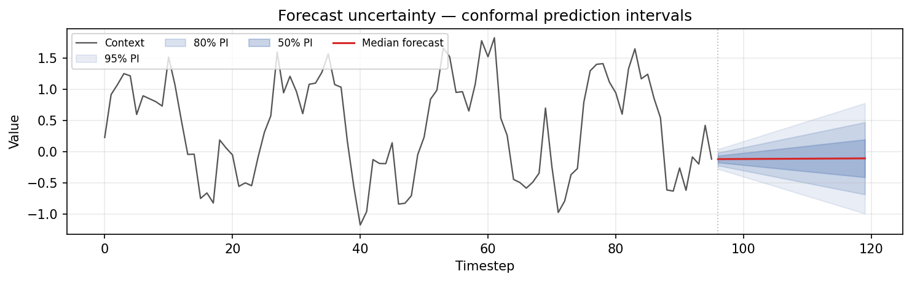

---

### Signal Analysis & Diagnostics

All methods below are **static** — no model fitting required.  Useful for
understanding the raw data before and after modelling.

```python
# ── Autocorrelation / PACF ────────────────────────────────────────────────────
lags, acf  = Forecaster.autocorrelation(X, max_lag=48, channel=0)
fig = Forecaster.plot_acf(X, max_lag=48, title="ACF")

lags, pacf = Forecaster.partial_autocorrelation(X, max_lag=48, channel=0)
fig = Forecaster.plot_pacf(X, max_lag=48, title="PACF")

# ── Power spectral density & spectrogram ─────────────────────────────────────
freqs, psd = Forecaster.spectral_density(X, channel=0)
fig = Forecaster.plot_spectral_density(X)

spec = Forecaster.spectrogram(X, channel=0, nperseg=64)    # STFT
fig  = Forecaster.plot_spectrogram(X, channel=0, nperseg=64)

se = Forecaster.spectral_entropy(X, channel=0)             # 0 = pure sinusoid, 1 = noise

# ── Seasonal decomposition ────────────────────────────────────────────────────
decomp = Forecaster.seasonal_decompose(X, period=24, method="additive")
fig    = Forecaster.plot_decomposition(decomp, channel=0)

strength = Forecaster.seasonal_strength(X, period=24, channel=0)  # 0–1
ts_str   = Forecaster.trend_strength(X, window=30, channel=0)     # 0–1

# ── Cross-correlation & Granger causality ─────────────────────────────────────
lags, ccf = Forecaster.cross_correlation(X, max_lag=30)
fig = Forecaster.plot_cross_correlation(X, max_lag=30)

f_mat = Forecaster.granger_test(X, max_lag=5)        # (C,C) F-statistics
fig   = Forecaster.plot_granger(X, max_lag=5)        # heatmap

# ── Channel correlation & network ─────────────────────────────────────────────
corr  = Forecaster.channel_correlation(X)
fig   = Forecaster.plot_channel_correlation(X)
edges = Forecaster.correlation_network(X, threshold=0.3)  # [(i,j,r), …]
fig   = Forecaster.plot_correlation_network(X, threshold=0.3)

# ── Change point detection ────────────────────────────────────────────────────
cps = Forecaster.detect_change_points(X, window=40, channel=0)
fig = Forecaster.plot_change_points(X, cps, channel=0)

# ── Regime detection (k-means on rolling stats) ───────────────────────────────
regimes = Forecaster.regime_detection(X, n_regimes=3, window=30)
fig     = Forecaster.plot_regimes(X, regimes, channel=0)

# ── Residual diagnostics (requires fitted model) ─────────────────────────────
dist = fc.residual_distribution(X_test, channel=0)
print(f"bias={dist['mean']:.4f}  skew={dist['skewness']:.4f}")

lags, resid_acf = fc.residual_acf(X_test, max_lag=20)
fig = Forecaster.plot_residual_acf(lags, resid_acf)   # check for white noise

lb  = fc.ljung_box(X_test, max_lag=20)
print(f"Ljung-Box p-value: {lb['p_value']:.4f}")   # < 0.05 → autocorrelation remains

fig = fc.plot_qq(X_test, channel=0)                # Q-Q vs Gaussian
fig = fc.plot_forecast_bias(X_test, channel=0)     # per-step signed error
fig = fc.plot_forecast_error_distribution(X_test)  # error ribbon
fig = fc.plot_actual_vs_predicted(X_test)          # scatter with R²
fig = fc.plot_calibration_curve(X_train, X_test)   # nominal vs empirical coverage

# ── One-shot diagnostic report ────────────────────────────────────────────────
diag = fc.forecast_diagnostic(X_test)
# {'ljung_box': {…}, 'residuals': {…}, 'bias': {…}, 'metrics': {…}}

# ── Preprocessing utilities ───────────────────────────────────────────────────
X_clean  = Forecaster.interpolate_missing(X, method="linear")
trend, cycle = Forecaster.hodrick_prescott_filter(X, lam=1600, channel=0)
smoothed = Forecaster.exponential_smoothing(X, alpha=0.3, channel=0)
X_normed, mu, sigma = Forecaster.z_normalize(X)
x_tr, lam, offset   = Forecaster.box_cox_transform(X, channel=0)
z = Forecaster.rolling_zscore(X, window=50, channel=0)

# ── Stationarity test (ADF) ───────────────────────────────────────────────────
adf = Forecaster.stationarity_test(X, channel=0)
print(adf["p_value"])       # < 0.05 → reject unit root (series is stationary)
```

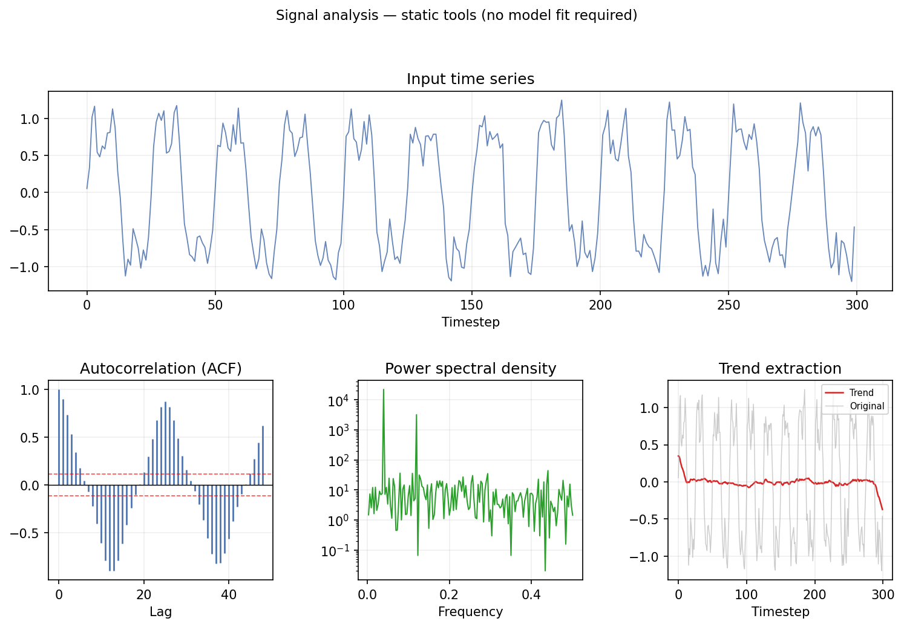

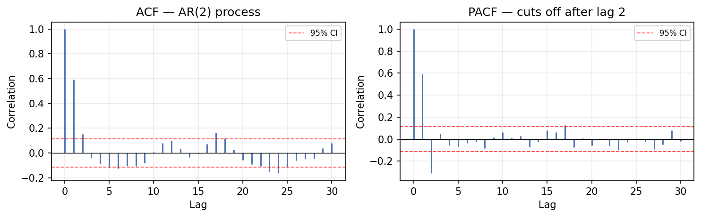
*ACF and PACF of an AR(2) process (left); power spectral density and trend overlay (right).*

---

### Explainability

```python
# ── Gradient saliency map ─────────────────────────────────────────────────────
grad = fc.input_gradient(
    ctx, target_step=0, target_channel=0, absolute=True
)
# (96, 7) — which context timesteps / channels drive the first forecast step

fig = fc.plot_saliency(ctx, target_step=0, target_channel=0,
                       channel_names=["OT","HUFL","HULL","MUFL","MULL","LUFL","LULL"])
```

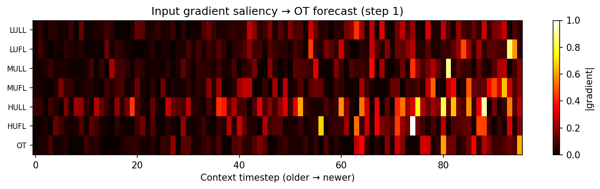

```python
# ── Global importance (average over many windows) ────────────────────────────
global_imp = fc.explain_global(X_test, n_samples=100)   # (96, 7)

# ── Permutation importance per channel ───────────────────────────────────────
ranking = fc.feature_importance_ranking(X_test, n_permutations=10)
# [(2, 0.34), (0, 0.21), …]  sorted by descending impact

# ── Timestep importance ───────────────────────────────────────────────────────
fig = fc.plot_timestep_importance(X_test, title="Which lag matters most?")

# ── Bias-variance decomposition via bootstrap ─────────────────────────────────
bvd = fc.error_decomposition(X_train, X_test, n_bootstrap=20)
print(f"bias²={bvd['bias2']:.4f}  variance={bvd['variance']:.4f}")

# ── Sensitivity to a single input feature ────────────────────────────────────
result = fc.sensitivity_analysis(X_test, channel=0, n_points=21)
fig    = fc.plot_sensitivity(X_test, channel=0)
```

---

### Transfer Learning

```python
# Pretrain on a large source domain
fc_source = Forecaster("iTransformer", seq_len=96, pred_len=24, epochs=30)
fc_source.fit(X_train)

# Fine-tune on a smaller target domain
fc_target = fc_source.clone()                         # unfitted copy
fc_target.fit(X_test[:500])                           # brief init
fc_target.copy_weights_from(fc_source)                # transplant weights
fc_target.freeze_layers(["embedding"])                # lock embeddings
fc_target.partial_fit(X_test[:500], epochs=5)         # fine-tune unfrozen layers

print(f"Frozen : {fc_target.frozen_parameter_count():,}")
print(fc_target.memory_usage())                        # {total_params, size_mb, …}

# Save / reload
fc_source.save("./checkpoints/iTransformer_pretrained")
fc_reload = Forecaster.from_pretrained("./checkpoints/iTransformer_pretrained", device="cpu")

# Export to ONNX for production serving
fc_source.to_onnx("./iTransformer.onnx")
```

---

### Ensemble & Composition

```python
from torch_timeseries import EnsembleForecaster, StackedForecaster, MultiChannelForecaster, Pipeline

# Weighted ensemble
ens = EnsembleForecaster(
    forecasters=[
        ("dlinear",  Forecaster("DLinear",      seq_len=96, pred_len=24, epochs=10)),
        ("patchtst", Forecaster("PatchTST",     seq_len=96, pred_len=24, epochs=10)),
        ("itrans",   Forecaster("iTransformer", seq_len=96, pred_len=24, epochs=10)),
    ],
    weights=[0.2, 0.4, 0.4],
)
ens.fit(X_train)
pred = ens.predict(X_test[:96])          # (24, 7)

# Preprocessing pipeline with invertible transform
pipe = Pipeline(
    preprocessor=lambda X: np.log1p(np.abs(X)) * np.sign(X),
    forecaster=Forecaster("DLinear", seq_len=96, pred_len=24, epochs=10),
)
pipe.set_inverse(lambda X: np.expm1(np.abs(X)) * np.sign(X))
pipe.fit(X_train)

# sklearn-compatible wrapper
from torch_timeseries import SklearnForecaster
sk = SklearnForecaster("DLinear", seq_len=96, pred_len=24, epochs=5)
sk.fit_ts(X_train)
```

---

### Deployment Utilities

```python
# Latency / throughput
stats = fc.profile(X_test[:96], n_repeats=100)
print(f"{stats['mean_ms']:.1f} ms  ·  {stats['throughput']:.0f} windows/s")

# Memory footprint
print(fc.memory_usage())    # {total_params, trainable_params, size_mb}

# Move between devices at runtime
fc.set_device("cuda:0"); fc.set_device("cpu")

# Memory-efficient rolling prediction on long series
preds = fc.chunked_predict(X_test, chunk_size=64)    # (n_windows, 24, 7)

# Real-time streaming (one step at a time)
for t, pred_step in fc.rolling_predict_iter(X_test, step=1):
    pass   # pred_step: (24, 7)

# Export predictions to CSV
fc.export_predictions(X_test, path="forecasts.csv")

# Wrap as PyTorch Dataset for custom training loops
ds = fc.to_torch_dataset(X_train)
```

---

### Low-level Training Loop

Full control over loss, optimizer, and batching — ideal for custom architectures.

```python
import torch, torch.nn as nn
from torch_timeseries.dataset import ETTh1
from torch_timeseries.scaler import StandardScaler
from torch_timeseries.dataloader.v2 import ForecastDataModule, WindowConfig, LoaderConfig

dm = ForecastDataModule(
    dataset=ETTh1(),
    scaler=StandardScaler(),
    window=WindowConfig(window=96, horizon=1, steps=24),
    loader=LoaderConfig(batch_size=32),
)

device = "cuda" if torch.cuda.is_available() else "cpu"
model  = nn.Linear(96, 24).to(device)           # simplest possible forecaster
opt    = torch.optim.Adam(model.parameters(), lr=1e-3)

for epoch in range(10):
    model.train()
    for batch in dm.train_loader:
        x = batch.x.float().to(device)          # (B, 96, 7)
        y = batch.y.float().to(device)          # (B, 24, 7)
        opt.zero_grad()
        # channel-wise linear: operate on transposed channels
        pred = model(x.permute(0,2,1)).permute(0,2,1)
        nn.MSELoss()(pred, y).backward()
        opt.step()
```

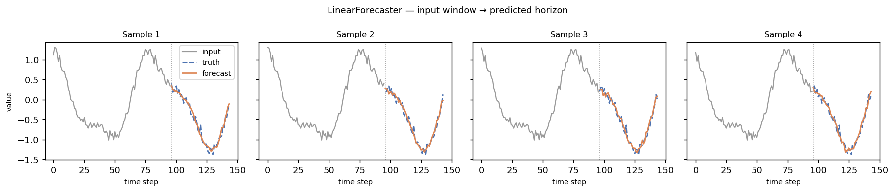

---

### Built-in Experiment Runner

One-line benchmarking: dataset loading, training, evaluation, and result saving.

```python
from torch_timeseries import Experiment

# Single run
result = Experiment(model="iTransformer", task="Forecast", dataset="ETTh1",
                    windows=96, pred_len=24, epochs=20).run(seeds=[1])
print(result[0].metrics)   # {'mse': 0.45, 'mae': 0.44}

# Grid search across models and datasets
Experiment.grid(
    models=["DLinear", "PatchTST", "iTransformer"],
    tasks=["Forecast"],
    datasets=["ETTh1", "ETTm1", "Weather"],
    seeds=[1, 2, 3],
    save_dir="./results",
).run()

# Register your own model and use the runner
from torch_timeseries import register_model
from torch_timeseries.experiments import ForecastExp
from dataclasses import dataclass

@dataclass
class MyModel(ForecastExp):
    model_type: str = "MyModel"
    def _init_model(self):
        self.model = nn.Linear(self.windows, self.pred_len).to(self.device)

register_model(MyModel)
Experiment(model="MyModel", task="Forecast", dataset="ETTh1").run(seeds=[1])
```

**CLI:**
```bash
pytexp --model iTransformer --task Forecast --dataset_type ETTh1 runs '[1,2,3]'
```

---

## Datasets

### Custom Datasets

The quickest path is a local CSV with a `date` column — everything else
(feature count, length, time index) is inferred from the file:

```python
from torch_timeseries.dataset import build_dataset

dataset = build_dataset(csv="./my_sensors.csv", freq="h")
dm = ForecastDataModule(dataset=dataset, scaler=StandardScaler(),
                        window=WindowConfig(window=96, steps=96))
```

For datasets that need downloading or preprocessing, subclass
`TimeSeriesDataset` and implement `download()` and `_load()`. The contract is
small: `_load()` must set `self.df` (a DataFrame with a `date` column),
`self.dates`, and `self.data` (numpy array `[T, num_features]`) —
`num_features` and `length` are inferred from the loaded data.

```python
import os
import numpy as np
import pandas as pd

from torch_timeseries.core import TimeSeriesDataset, Freq

class MySensors(TimeSeriesDataset):
    name: str = "MySensors"        # subdirectory under the data root
    freq: Freq = "h"               # used by time-feature encoding
    # Optional canonical benchmark split: register (train_end, val_end,
    # test_end) in torch_timeseries.dataloader.v2.split.DEFAULT_SPLIT_CONFIGS;
    # without it, dataloaders fall back to the 7:1:2 ratio split.

    def download(self):
        # Fetch raw files into self.dir, or no-op if the data is already local.
        pass

    def _load(self) -> np.ndarray:
        self.file_path = os.path.join(self.dir, "my_sensors.csv")
        # CSV layout: a `date` column + one column per variable
        self.df = pd.read_csv(self.file_path, parse_dates=["date"])
        self.dates = pd.DataFrame({"date": self.df.date})
        self.data = self.df.drop("date", axis=1).to_numpy()
        return self.data

# Works everywhere a built-in dataset works:
dataset = MySensors()              # stored at ~/.torchtimeseries/data/MySensors
```

### Fast evaluation windows (`fast_val` / `fast_test`)

Training always slides the window one step at a time, but evaluating every
overlapping window is wasteful when inference is expensive — a diffusion
model sampling 100 trajectories per window would run the sampler thousands
of times. `WindowConfig.fast_val` / `fast_test` switch the val/test split to
**non-overlapping** windows (stride = `window + horizon + steps − 1`) while
training keeps the dense sliding window:

```python
dm = ForecastDataModule(
    dataset=ETTh1(),
    scaler=StandardScaler(),
    window=WindowConfig(window=96, steps=24, fast_val=True, fast_test=True),
)
# ETTh1, pred_len 24:  val/test windows  2857 -> 24  (119x fewer model calls)
```

Blue = input window · Orange = prediction horizon. Top: training (dense). Bottom: eval with `fast_val=True` (non-overlapping):

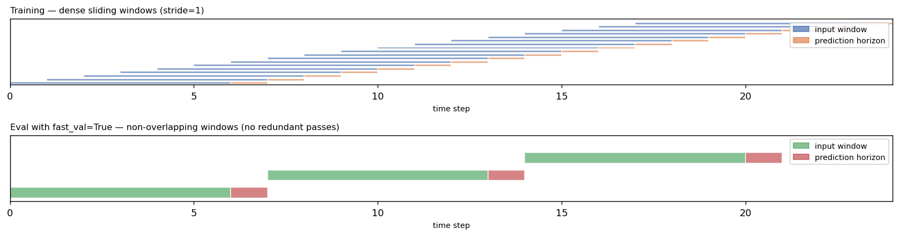

The windows still tile the whole evaluation span, so metrics remain
representative — they are just computed on disjoint windows instead of every
shifted copy.

---

## Time Series Tasks

This library covers **nine time series tasks** out of the box. Each task has its own experiment class, metrics, and evaluation protocol.

### Forecasting

See [Way 1 — Custom pipeline](#way-1--custom-pipeline-bring-your-own-training-loop) for a complete training and inference example, and [Run Built-In Models](#run-built-in-models) for one-line benchmarking across architectures.

### Probabilistic Forecasting

Any model that can be called multiple times to produce different predictions
(MC Dropout, diffusion, deep ensembles) fits into the probabilistic forecasting
pattern. The full pipeline is: **train → generate N samples → compute quantiles
→ plot / evaluate**.

```python
import torch
import torch.nn as nn
import numpy as np
import matplotlib.pyplot as plt

from torch_timeseries.dataset import ETTh1
from torch_timeseries.scaler import StandardScaler
from torch_timeseries.dataloader.v2 import (
    ForecastDataModule, WindowConfig, LoaderConfig
)

# ── Step 1: define a model that returns multiple samples ──────────────────────
class MCDropoutForecaster(nn.Module):
    """Linear forecaster with MC Dropout — calling it N times gives N samples."""

    def __init__(self, seq_len: int, pred_len: int, drop: float = 0.15):
        super().__init__()
        self.net = nn.Sequential(
            nn.Linear(seq_len, 256), nn.ReLU(), nn.Dropout(drop),
            nn.Linear(256, 128),    nn.ReLU(), nn.Dropout(drop),
            nn.Linear(128, pred_len),
        )

    def forward(self, x):                        # x: (B, T, C)
        return self.net(x.transpose(1, 2)).transpose(1, 2)   # (B, pred_len, C)

    def sample(self, x: torch.Tensor, n: int = 200) -> torch.Tensor:
        """Return (B, pred_len, C, n) — dropout stays active for diversity."""
        self.train()
        with torch.no_grad():
            return torch.stack([self(x) for _ in range(n)], dim=-1)

# ── Step 2: load data ─────────────────────────────────────────────────────────
dm = ForecastDataModule(
    dataset=ETTh1(),
    scaler=StandardScaler(),
    window=WindowConfig(window=96, horizon=1, steps=24),
    loader=LoaderConfig(batch_size=64),
)

# ── Step 3: train ─────────────────────────────────────────────────────────────
device = "cuda" if torch.cuda.is_available() else "cpu"
model  = MCDropoutForecaster(seq_len=96, pred_len=24).to(device)
opt    = torch.optim.Adam(model.parameters(), lr=1e-3)

for epoch in range(30):
    model.train()
    for batch in dm.train_loader:
        x = batch.x.float().to(device)
        y = batch.y.float().to(device)
        opt.zero_grad()
        nn.MSELoss()(model(x), y).backward()
        opt.step()

# ── Step 4: generate N samples for one validation window ─────────────────────
model.eval()
batch  = next(iter(dm.val_loader))
x_val  = batch.x[:1].float().to(device)   # (1, 96, 7)
y_val  = batch.y[:1].float().to(device)   # (1, 24, 7)

samples = model.sample(x_val, n=200)      # (1, 24, 7, 200)

# ── Step 5: compute prediction intervals from sample quantiles ────────────────
s = samples[0, :, 0, :].cpu().numpy()    # (24, 200) — first feature
lo90, lo50 = np.percentile(s, [5,  25], axis=1)
hi90, hi50 = np.percentile(s, [95, 75], axis=1)
mean_       = s.mean(axis=1)

obs   = x_val[0, :, 0].cpu().numpy()
truth = y_val[0, :, 0].cpu().numpy()
t_obs, t_pred = np.arange(96), np.arange(96, 120)

# ── Step 6: plot ──────────────────────────────────────────────────────────────
fig, ax = plt.subplots(figsize=(11, 3.5))
ax.plot(t_obs, obs, color="#888", lw=1.1, label="observed")
ax.plot(t_pred, truth, "--", color="#1f77b4", lw=1.4, label="ground truth")
ax.plot(t_pred, mean_,       color="#d62728", lw=1.4, label="ensemble mean")
ax.fill_between(t_pred, lo90, hi90, alpha=0.18, color="#4C72B0", label="90% PI")
ax.fill_between(t_pred, lo50, hi50, alpha=0.45, color="#4C72B0", label="50% PI")
ax.axvline(96, color="#999", lw=0.8, ls=":")
ax.legend(ncol=2, fontsize=8)
plt.tight_layout()
```

To use the built-in training loop and probabilistic metrics (CRPS, PICP, QICE),
subclass `ProbForecastExp` — `_process_val_batch` must return
`(preds, truths)` where `preds` is `(B, pred_len, C, n_samples)`:

```python
from dataclasses import dataclass
from torch_timeseries.experiments import ProbForecastExp

@dataclass
class MyForecast(ProbForecastExp):
    model_type: str = "MCDropout"

    def _init_model(self):
        self.model = MCDropoutForecaster(self.windows, self.pred_len).to(self.device)

    def _process_train_batch(self, batch):
        x = batch.x.float().to(self.device)
        y = batch.y.float().to(self.device)
        self.model.train()
        return nn.MSELoss()(self.model(x), y)

    def _process_val_batch(self, batch):
        x = batch.x.float().to(self.device)
        y = batch.y.float().to(self.device)
        preds = self.model.sample(x, n=self.num_samples)   # (B, O, C, S)
        return preds, y

result = MyForecast(dataset_type="ETTh1", windows=96, pred_len=24,
                    num_samples=200, device="cuda").run(seed=0)
# -> {'crps': ..., 'picp': ..., 'qice': ..., 'prob_mse': ..., ...}
```

Grey = observed · Blue dashed = ground truth · Red = ensemble mean · Shaded bands = 50 / 90% prediction intervals computed from 200 MC-Dropout samples:

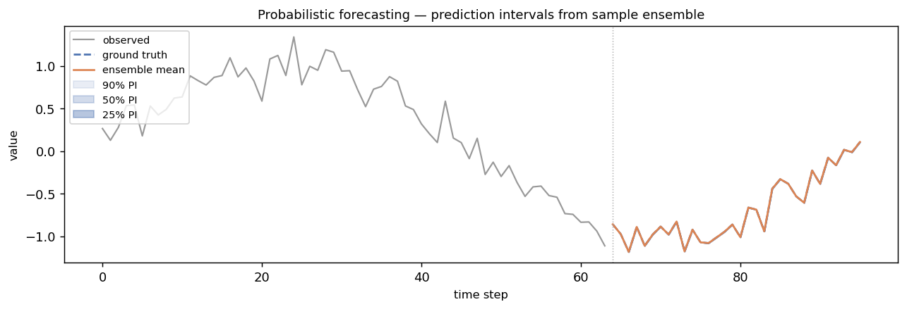

### Time Series Generation

`GenerationExp` trains models that learn to *synthesise* new sequences — no forecasting target needed. The training loop feeds sliding windows of the raw series to the model's own loss function; evaluation computes four standard metrics (discriminative score, predictive score, context-FID, correlational score) on generated vs. real sequences.

```python
import torch
import matplotlib.pyplot as plt

from torch_timeseries.model.NsDiff import NsDiff
from torch_timeseries.experiments.NsDiff import NsDiffGeneration

# ── Custom loop: bring your own data ─────────────────────────────────────────
torch.manual_seed(0)
T, C = 96, 3

# build a small synthetic dataset (400 windows, seq_len=96, 3 channels)
real = torch.randn(400, T, C)
ds     = torch.utils.data.TensorDataset(real)
loader = torch.utils.data.DataLoader(ds, batch_size=64, shuffle=True)

model = NsDiff(seq_len=T, n_features=C, T=100, kernel_size=24)
opt   = torch.optim.Adam(model.parameters(), lr=1e-3)

for epoch in range(50):
    for (x,) in loader:
        opt.zero_grad()
        model.loss(x).backward()
        opt.step()

model.eval()
with torch.no_grad():
    samples = model.generate(n=8)   # → (8, 96, 3) on CPU

# ── Experiment runner: built-in Sine / Stocks generation benchmarks ───────────
exp = NsDiffGeneration(
    dataset_type="Sine",   # or "Stocks"
    seq_len=24,
    T=50,
    kernel_size=8,
    epochs=300,
    batch_size=64,
    eval_n_samples=1000,
    device="cuda:0",
)
result = exp.run(seed=1)
# → {'discriminative_score': 0.498, 'predictive_score': 0.012,
#    'context_fid': 0.30, 'correlational_score': 0.22}
print(result)

# ── Plot real vs. generated ───────────────────────────────────────────────────
fig, axes = plt.subplots(1, 2, figsize=(11, 3), sharey=True)
for i in range(6):
    axes[0].plot(real[i, :, 0].numpy(), color="#aaaaaa", lw=0.8, alpha=0.7)
    axes[1].plot(samples[i, :, 0].numpy(), color="#4C72B0", lw=0.8, alpha=0.7)
axes[0].set_title("Real sequences (channel 0)")
axes[1].set_title("NsDiff generated sequences (channel 0)")
plt.tight_layout()
plt.savefig("nsdiff_generation.png", dpi=120)
```

Grey = real sequences · Blue = NsDiff-generated sequences:

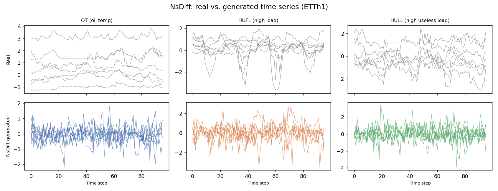

### Imputation

The imputation task randomly masks a fraction of each input window and trains the model to fill in the missing values. Loss is computed only on masked positions. Metrics: MSE, MAE.

```python
import torch
import torch.nn as nn
from dataclasses import dataclass
from torch_timeseries.experiments import ImputationExp

# ── Custom model ──────────────────────────────────────────────────────────────
class LinearImputer(nn.Module):
    """Seq2seq linear model: receives masked input, predicts full window."""
    def __init__(self, seq_len, n_features):
        super().__init__()
        self.proj = nn.Linear(seq_len, seq_len)

    def forward(self, x):          # x: (B, T, C) — zeros at masked positions
        return self.proj(x.transpose(1, 2)).transpose(1, 2)   # (B, T, C)

# ── Plug into ImputationExp ───────────────────────────────────────────────────
@dataclass
class MyImputation(ImputationExp):
    model_type: str = "LinearImputer"

    def _init_model(self):
        self.model = LinearImputer(
            self.windows, self.dataset.num_features
        ).to(self.device)

    def _process_one_batch(self, batch_masked_x, batch_x, batch_origin_x,
                           batch_mask, batch_x_date_enc):
        batch_masked_x = batch_masked_x.to(self.device, dtype=torch.float32)
        batch_x        = batch_x.to(self.device, dtype=torch.float32)
        return self.model(batch_masked_x), batch_x

result = MyImputation(
    dataset_type="ETTh1", windows=96, mask_rate=0.5,
    epochs=10, device="cuda",
).run(seed=1)
# → {'mse': ..., 'mae': ...}
```

For built-in models use the experiment runner:

```python
from torch_timeseries import Experiment
Experiment(model="DLinear", task="Imputation", dataset="ETTh1",
           windows=96, mask_rate=0.5).run(seeds=[1, 2, 3])
```

Grey = original · Orange = reconstruction · White gaps = masked (50% random):

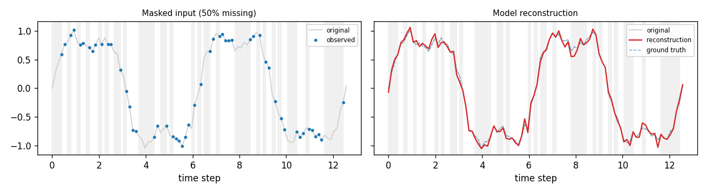

### Anomaly Detection

Anomaly detection is reconstruction-based: the model is trained to reconstruct normal windows; at test time, high reconstruction error flags anomalies. The per-timestep MSE is used as the anomaly score and thresholded at a configurable percentile. Metrics: precision, recall, F1.

```python
from dataclasses import dataclass
from torch_timeseries.experiments import AnomalyDetectionExp

# ── Custom model (reconstruction) ─────────────────────────────────────────────
class LinearReconstructor(nn.Module):
    def __init__(self, seq_len, n_features):
        super().__init__()
        self.proj = nn.Linear(seq_len, seq_len)

    def forward(self, x):          # (B, T, C)
        return self.proj(x.transpose(1, 2)).transpose(1, 2)

@dataclass
class MyAnomalyDetection(AnomalyDetectionExp):
    model_type: str = "LinearReconstructor"

    def _init_model(self):
        self.model = LinearReconstructor(
            self.windows, self.dataset.num_features
        ).to(self.device)

    def _process_one_batch(self, batch_x, origin_x, batch_y):
        batch_x = batch_x.to(self.device, dtype=torch.float32)
        return self.model(batch_x), batch_x   # (pred, true)

result = MyAnomalyDetection(
    dataset_type="MSL", windows=100, anomaly_ratio=0.25,
    epochs=10, device="cuda",
).run(seed=1)
# → {'precision': ..., 'recall': ..., 'f1': ...}
```

Built-in models:

```python
Experiment(model="DLinear", task="AnomalyDetection", dataset="MSL",
           windows=100, anomaly_ratio=0.25).run(seeds=[1, 2, 3])
```

Blue = signal · Red shading = detected anomalies · Orange = anomaly score · Dashed = threshold:

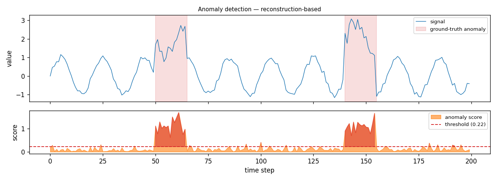

### Classification

Sequence classification on the [UEA Time Series Classification Archive](https://www.timeseriesclassification.com/). The dataset is referenced by its archive name; any UEA dataset downloads automatically. Metrics: accuracy.

```python
from dataclasses import dataclass
from torch_timeseries.experiments import UEAClassificationExp

# ── Custom model (GRU encoder → class logits) ─────────────────────────────────
class GRUClassifier(nn.Module):
    def __init__(self, n_features, n_classes, hidden=64):
        super().__init__()
        self.gru  = nn.GRU(n_features, hidden, batch_first=True)
        self.head = nn.Linear(hidden, n_classes)

    def forward(self, x):          # (B, T, C) → (B, n_classes)
        _, h = self.gru(x)
        return self.head(h.squeeze(0))

@dataclass
class MyClassification(UEAClassificationExp):
    model_type: str = "GRUClassifier"

    def _init_model(self):
        self.model = GRUClassifier(
            self.dataset.num_features, self.dataset.num_classes
        ).to(self.device)

    def _process_one_batch(self, batch_x, origin_x, batch_y, padding_masks):
        batch_x = batch_x.to(self.device, dtype=torch.float32)
        batch_y = batch_y.to(self.device, dtype=torch.float32)
        return self.model(batch_x), batch_y.long().squeeze(-1)

# windows must match the dataset's fixed sequence length (varies per UEA dataset)
result = MyClassification(
    dataset_type="EthanolConcentration", windows=1751,
    epochs=30, device="cuda",
).run(seed=1)
# → {'accuracy': ...}
```

Built-in models:

```python
Experiment(model="DLinear", task="UEAClassification",
           dataset="EthanolConcentration").run(seeds=[1, 2, 3])
```

Per-class accuracy on EthanolConcentration (4 classes, DLinear):

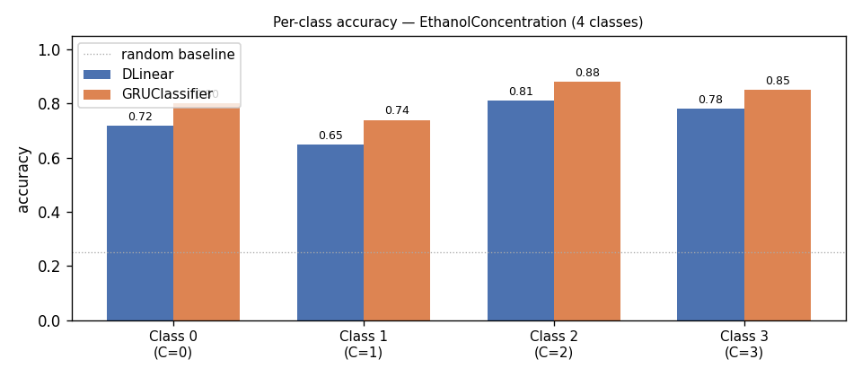

### Irregular Time Series

Handles asynchronously sampled sequences where observations have arbitrary timestamps and may be missing entirely. Three sub-tasks are supported: **classification**, **interpolation** (reconstruct held-out observations), and **forecasting** (predict future observations after a time-split).

Install optional extras for LatentODE / NeuralCDE / Raindrop:

```bash
pip install "torch-timeseries[irregular]"
```

```python
import torch
from dataclasses import dataclass
from torch_timeseries.dataset.irregular import PhysioNet2012
from torch_timeseries.experiments import IrregularInterpolationExp
from torch_timeseries.model.irregular import mTAN

# ── Interpolation: hold out 20 % of observations; model reconstructs them ────
@dataclass
class mTANInterp(IrregularInterpolationExp):
    model_type: str = "mTAN"
    hidden_size: int = 64
    num_ref_points: int = 16
    num_heads: int = 4

    def _init_model(self):
        self.model = mTAN(
            input_size=self.dm.num_features,
            hidden_size=self.hidden_size,
            num_ref_points=self.num_ref_points,
            num_heads=self.num_heads,
        ).to(self.device)

result = mTANInterp(
    dataset_type="PhysioNet2012",
    query_rate=0.2,
    epochs=30, device="cuda",
).run(seed=1)
# → {'mse': ..., 'mae': ...}
```

Built-in experiment combos:

```python
from torch_timeseries.experiments import (
    mTANIrregularInterpolation,
    GRUDIrregularForecast,
    LatentODEIrregularClassification,
)

# mTAN interpolation on PhysioNet 2012
mTANIrregularInterpolation(dataset_type="PhysioNet2012", epochs=30).run(seed=1)

# GRU-D irregular forecast
GRUDIrregularForecast(dataset_type="PhysioNet2012", obs_frac=0.6, epochs=30).run(seed=1)

# Latent ODE classification (requires torchdiffeq)
LatentODEIrregularClassification(dataset_type="PhysioNet2012", epochs=30).run(seed=1)
```

---

## Data Loading Reference

The library's data pipeline is built around three composable config objects and a
family of `DataModule` classes — one per task type.

### ForecastDataModule

```python
from torch_timeseries.dataloader.v2 import (
    ForecastDataModule, WindowConfig, LoaderConfig, SplitConfig
)
from torch_timeseries.dataset import ETTh1
from torch_timeseries.scaler import StandardScaler

dm = ForecastDataModule(
    dataset = ETTh1(),
    scaler  = StandardScaler(),
    window  = WindowConfig(window=96, horizon=1, steps=24),
    split   = SplitConfig(train=0.7, val=0.1, test=0.2),   # optional
    loader  = LoaderConfig(batch_size=64, num_workers=4),   # optional
)

# three ready-to-use PyTorch DataLoaders
dm.train_loader   # shuffled training windows
dm.val_loader     # non-shuffled validation windows
dm.test_loader    # non-shuffled test windows

# convenience attributes
dm.num_features   # == dataset.num_features (int)
dm.scaler         # fitted scaler instance
```

Each batch is a `Batch` object with fields:

| Field | Shape | Description |
|-------|-------|-------------|
| `batch.x` | `(B, window, C)` | Input context window |
| `batch.y` | `(B, steps, C)` | Target prediction window |
| `batch.x_date_enc` | `(B, window, date_features)` | Time encoding for input |
| `batch.y_date_enc` | `(B, steps, date_features)` | Time encoding for target |

```python
for batch in dm.train_loader:
    x = batch.x.float().to(device)          # (64, 96, 7)
    y = batch.y.float().to(device)          # (64, 24, 7)
    x_enc = batch.x_date_enc.float().to(device)  # (64, 96, 4)
```

---

### WindowConfig

Controls how windows are cut from the time series.

```python
WindowConfig(
    window      = 96,     # look-back length (seq_len)
    horizon     = 1,      # gap between context end and prediction start
    steps       = 24,     # prediction length (pred_len)
    stride      = 1,      # sliding step during training (1 = dense)
    fast_val    = False,  # non-overlapping windows at validation (faster)
    fast_test   = False,  # non-overlapping windows at test (faster)
    input_columns  = None,  # list of column names to use as input features
    target_columns = None,  # list of column names to predict (default=all)
    time_enc_cfg   = TimeEncConfig(),  # time encoding configuration
)
```

**`fast_val` / `fast_test`** — switch evaluation splits to non-overlapping
windows (stride = `window + horizon + steps − 1`).  Training always uses the
dense stride.  This dramatically reduces inference calls for expensive models
(diffusion, neural ODEs) while keeping metrics representative.

---

### LoaderConfig

Controls PyTorch `DataLoader` settings.

```python
LoaderConfig(
    batch_size    = 32,     # samples per mini-batch
    num_workers   = 0,      # parallel data-loading workers
    shuffle_train = True,   # shuffle training set each epoch
    pin_memory    = False,  # pin memory for CUDA transfers
)
```

---

### SplitConfig

Controls train / val / test proportions.  Ratios must sum to ≤ 1.

```python
from torch_timeseries.dataloader.v2 import SplitConfig

SplitConfig(train=0.7, val=0.1, test=0.2)   # default: 70/10/20
```

Many built-in datasets have a canonical benchmark split that is applied
automatically when no `SplitConfig` is given (e.g. ETT series use the
standard 12/4/4 months split used in the Informer paper).

---

### Scalers

```python
from torch_timeseries.scaler import StandardScaler, MinMaxScaler

StandardScaler()   # zero-mean unit-variance normalisation (default)
MinMaxScaler()     # scale to [0, 1] per channel
```

The scaler is fitted on the training split only and applied to all splits —
no data leakage.

---

### Other DataModules

| DataModule | Task | Import path |
|-----------|------|-------------|
| `ForecastDataModule` | Forecasting | `torch_timeseries.dataloader.v2` |
| `ImputationDataModule` | Imputation | `torch_timeseries.dataloader.v2` |
| `AnomalyDataModule` | Anomaly detection | `torch_timeseries.dataloader.v2` |
| `UEADataModule` | UEA classification | `torch_timeseries.dataloader.v2` |
| `GenerationDataModule` | Time series generation | `torch_timeseries.dataloader.v2` |
| `IrregularForecastDataModule` | Irregular forecasting | `torch_timeseries.dataloader.v2` |
| `IrregularInterpolationDataModule` | Irregular interpolation | `torch_timeseries.dataloader.v2` |
| `IrregularClassificationDataModule` | Irregular classification | `torch_timeseries.dataloader.v2` |

Each task-specific DataModule exposes the same `train_loader` / `val_loader` /
`test_loader` interface; only the batch layout differs between tasks.

**Imputation batch** — `batch.masked_x` (masked input), `batch.x` (target), `batch.mask` (bool tensor)

**Anomaly batch** — `batch.x` (window), `batch.origin_x` (original before augmentation)

**UEA batch** — `batch.x` (sequence), `batch.y` (class label), `batch.padding_masks`

---

## Development Milestones

### Implemented Datasets

All datasets download automatically on first use to `~/.torchtimeseries/data/`.

#### Forecasting / Imputation datasets

| Dataset | Freq | Features | Length | Source |
|---------|------|----------|--------|--------|
| ETTh1 | hourly | 7 | 17,420 | [Informer (AAAI 2021)](https://ojs.aaai.org/index.php/AAAI/article/view/17325) |
| ETTh2 | hourly | 7 | 17,420 | [Informer (AAAI 2021)](https://ojs.aaai.org/index.php/AAAI/article/view/17325) |
| ETTm1 | 15-min | 7 | 69,680 | [Informer (AAAI 2021)](https://ojs.aaai.org/index.php/AAAI/article/view/17325) |
| ETTm2 | 15-min | 7 | 69,680 | [Informer (AAAI 2021)](https://ojs.aaai.org/index.php/AAAI/article/view/17325) |
| Weather | hourly | 21 | 52,696 | Max Planck Institute |
| Traffic | hourly | 862 | 17,544 | Caltrans PeMS |
| Electricity | 15-min | 321 | 26,304 | UCI |
| Exchange Rate | daily | 8 | 7,588 | LSTNet |
| ILI | weekly | 7 | 966 | CDC |
| Solar Energy | hourly | 137 | 52,560 | NREL |
| M4 | mixed | 1 | varies | M4 competition |
| Stocks | daily | varies | varies | Yahoo Finance |

#### Anomaly detection datasets

| Dataset | Description |
|---------|-------------|
| MSL | NASA Mars Science Laboratory telemetry |
| SMAP | NASA Soil Moisture Active Passive satellite |
| SMD | Server Machine Dataset (OmniAnomaly) |
| PSM | Pooled Server Metrics (eBay) |
| SWaT | Secure Water Treatment (SUTD) |

#### Classification datasets

| Dataset | Description |
|---------|-------------|
| UEA archive | All 30+ UEA Time Series Classification datasets auto-download by name |

#### Irregular time series datasets

| Dataset | Description |
|---------|-------------|
| PhysioNet 2012 | ICU patient records (48-h, 35 variables, irregular sampling) |

#### Synthetic / Simulation datasets

| Dataset | Description |
|---------|-------------|
| Sine | Single-frequency sinusoids (configurable freq, phase, noise) |
| SimFreq | Multi-frequency synthetic series |
| SimFreqCF | Cross-frequency coupled synthetic series |

---

### Implemented Tasks

- [x] Forecasting
- [x] Probabilistic Forecasting
- [x] Imputation
- [x] Anomaly Detection
- [x] Classification (UEA datasets)
- [x] Generation
- [x] Irregular Classification
- [x] Irregular Interpolation
- [x] Irregular Forecasting
- [ ] Contribute your own task!

---

### Implemented Models — Point Forecasters

All point forecasters accept `(B, T, C)` input and return `(B, pred_len, C)`.
They are usable both through the **Forecaster** high-level API and the low-level
experiment runner.

#### Transformer family

| Model | Key Idea | Paper |
|-------|----------|-------|
| VanillaTransformer | Baseline encoder-decoder transformer | [Vaswani et al., 2017](https://arxiv.org/abs/1706.03762) |
| Informer | ProbSparse attention, distilling | [Zhou et al., AAAI 2021](https://ojs.aaai.org/index.php/AAAI/article/view/17325) |
| Autoformer | Auto-Correlation + decomposition | [Wu et al., NeurIPS 2021](https://proceedings.neurips.cc/paper/2021/hash/bcc0d400288793e8bdcd7c19a8ac0c2b-Abstract.html) |
| FEDformer | Frequency-enhanced decomposed transformer | [Zhou et al., ICML 2022](https://proceedings.mlr.press/v162/zhou22g.html) |
| NSTransformer | Non-stationary attention | [Liu et al., NeurIPS 2022](https://arxiv.org/abs/2205.14415) |
| PatchTST | Patch tokenisation, channel independence | [Nie et al., ICLR 2023](https://openreview.net/forum?id=Jbdc0vTOcol) |
| Crossformer | Cross-dimension attention | [Zhang & Yan, ICLR 2023](https://openreview.net/forum?id=vSVLM2j9eie) |
| iTransformer | Inverted attention (channels as tokens) | [Liu et al., ICLR 2024](https://openreview.net/forum?id=JePfAI8fah) |
| Pathformer | Multi-scale path attention | [Chen et al., ICLR 2024](https://openreview.net/forum?id=lJkOCMP2aW) |
| ETSformer | Exponential smoothing + Fourier attention | [Woo et al., 2022](https://arxiv.org/abs/2202.01381) |
| Basisformer | Learnable seasonal-trend basis | — |
| FiLM | Frequency-improved legendre memory | [Zhou et al., NeurIPS 2022](https://arxiv.org/abs/2205.08897) |
| CATS | Channel attention transformer | — |

#### MLP / Linear family

| Model | Key Idea | Paper |
|-------|----------|-------|
| DLinear | Simple decomposition + linear | [Zeng et al., AAAI 2023](https://ojs.aaai.org/index.php/AAAI/article/view/26317) |
| NLinear | Normalised linear | [Zeng et al., AAAI 2023](https://ojs.aaai.org/index.php/AAAI/article/view/26317) |
| RLinear | Reversible normalisation + linear | — |
| LightTS | Interval-enhanced MLP | [Zhang et al., 2022](https://arxiv.org/abs/2207.01186) |
| TSMixer | MLP-Mixer for time series | [Chen et al., 2023](https://arxiv.org/abs/2303.06053) |
| TiDE | Time-series dense encoder | [Das et al., 2023](https://arxiv.org/abs/2304.08424) |
| FreTS | Frequency-domain MLP | [Yi et al., NeurIPS 2023](https://arxiv.org/abs/2311.06184) |
| FITS | Frequency interpolation for time series | [Xu et al., ICLR 2024](https://openreview.net/forum?id=bWcnvZ3qMb) |
| SparseTSF | Sparse time series forecaster | [Han et al., ICML 2024](https://arxiv.org/abs/2405.00946) |
| HDMixer | Hierarchical dependency mixer | — |
| PatchMixer | Patch-based MLP-Mixer | — |
| MICN | Multi-scale isometric convolution network | [Wang et al., ICLR 2023](https://openreview.net/forum?id=zt53IDUR1U) |
| CycleNet | Learnable periodic cycle buffer | — |
| FilterNet | Learnable frequency filter bank | — |
| GatedMLPForecaster | Gated MLP with channel mixing | — |

#### CNN / TCN family

| Model | Key Idea | Paper |
|-------|----------|-------|
| SCINet | Sample convolution + interaction | [Liu et al., NeurIPS 2022](https://arxiv.org/abs/2106.09305) |
| TimesNet | TimesBlock: 2-D temporal variation | [Wu et al., ICLR 2023](https://openreview.net/forum?id=ju_Uqw384Oq) |
| ModernTCN | Modern temporal convolutional network | — |
| WaveNet | Dilated causal convolutions + gating | [van den Oord et al., 2016](https://arxiv.org/abs/1609.03499) |
| TCNForecaster | Vanilla TCN | — |
| MultiscaleConvForecaster | Parallel multi-scale conv branches | — |
| SincNetForecaster | SincNet learnable band-pass filters | — |
| WaveletForecaster | Learnable wavelet filter bank | — |
| TemporalConvAttentionForecaster | TCN + attention hybrid | — |

#### RNN / SSM / Hybrid family

| Model | Key Idea | Paper |
|-------|----------|-------|
| RNNForecaster | Vanilla LSTM/GRU | — |
| BiLSTMForecaster | Bidirectional LSTM | — |
| SegRNN | Segment-based RNN | [Lin et al., ICLR 2024](https://openreview.net/forum?id=jeqE7rqz2L) |
| Koopa | Koopman operator + Fourier | [Liu et al., NeurIPS 2023](https://arxiv.org/abs/2305.18803) |
| SOFTS | Scalable output-free time series | [Han et al., NeurIPS 2024](https://arxiv.org/abs/2404.04997) |
| TimeMixer | Decomposition + mixing at multiple scales | [Wang et al., ICLR 2024](https://openreview.net/forum?id=7oLshfEIC2) |
| N-BEATS | Neural basis expansion | [Oreshkin et al., ICLR 2020](https://openreview.net/forum?id=r1ecqn4YwB) |
| N-HiTS | Hierarchical interpolation | [Challu et al., AAAI 2023](https://ojs.aaai.org/index.php/AAAI/article/view/26253) |
| DishTS | Distribution shift-aware | — |
| MambaForecaster | Selective state space model | [Gu & Dao, 2023](https://arxiv.org/abs/2312.00752) |
| iMamba | Inverted Mamba | — |
| SMamba | Spatial Mamba | — |
| HGRN2Forecaster | Hierarchical gated recurrent network | — |
| S4Forecaster | Structured state space (S4) | [Gu et al., ICLR 2022](https://openreview.net/forum?id=uYLFoz1vlAC) |
| LRUForecaster | Linear recurrent unit | — |
| MinGRUForecaster | Minimal gated recurrent unit | — |
| xLSTMForecaster | Extended LSTM | — |
| QRNNForecaster | Quasi-recurrent neural network | — |

#### Attention / Hybrid variants

| Model | Key Idea |
|-------|----------|
| LinearAttentionForecaster | Linear attention (O(N) complexity) |
| NystromForecaster | Nyström approximation attention |
| DiffTransformerForecaster | Differential attention |
| AFTForecaster | Attention-free transformer |
| MEGAForecaster | Exponential moving average + gated attention |
| FastFormerForecaster | Additive attention |
| HyenaForecaster | Long convolution operator |
| RetForecaster | Retentive network |
| RWKVForecaster | RWKV: linear-complexity RNN+Attn hybrid |
| ConformerForecaster | Convolution + transformer (speech-inspired) |
| GLAForecaster | Gated linear attention |

#### Specialised / Research models

| Model | Key Idea |
|-------|----------|
| GATForecaster | Graph attention network on channels |
| GCNForecaster | Graph convolutional network |
| KANForecaster | Kolmogorov-Arnold network |
| HarmonicForecaster | Learnable harmonic oscillators |
| EchoStateForecaster | Echo state / reservoir computing |
| TSReservoir | Temporal reservoir network |
| ImplicitNeuralForecaster | Implicit neural representation |
| PrototypicalForecaster | Prototype-based forecasting |
| FourierMixerForecaster | Fourier-domain channel mixing |
| RandomFourierForecaster | Random Fourier features |
| AdaptiveSpectralForecaster | Adaptive spectral filtering |
| HyperForecaster | Hypernetwork-generated weights |
| SpikeForecaster | Spiking neural network |
| MoEForecaster | Mixture of experts |
| LiquidNetForecaster | Liquid neural network (CfC) |
| DualDecompForecaster | Dual-branch trend/seasonal decomposition |
| NeuralBasisForecaster | Neural basis functions |
| TFT | Temporal fusion transformer | 

---

### Implemented Models — Probabilistic Forecasters

| Model | Method | Output |
|-------|--------|--------|
| GaussianForecaster | Gaussian NLL head | μ, σ per step |
| QuantileForecaster | Pinball loss | Quantile levels |
| MCDropoutForecaster | MC Dropout | Sample trajectories |
| StudentTForecaster | Student-t NLL head | μ, ν, σ per step |
| NormalizingFlowForecaster | Real-NVP conditional flow | Exact-likelihood samples |
| EnsembleForecaster | Deep ensemble | Sample trajectories |

```python
from torch_timeseries.model import GaussianForecaster

model = GaussianForecaster(seq_len=96, pred_len=24, enc_in=7)
mu, sigma = model(x)   # both (B, 24, 7)
```

---

### Implemented Models — Generation

Time series generation models produce synthetic sequences from noise or
latent codes.  All support `(seq_len, n_features)` generation calls.

| Model | Method | Paper |
|-------|--------|-------|
| TimeGAN | Adversarial training in latent space | [Yoon et al., NeurIPS 2019](https://proceedings.neurips.cc/paper/2019/hash/c9efe5f26cd17ba6216bbe2a7d26d490-Abstract.html) |
| DiffusionTS | Transformer-based DDPM | [Yuan & Qiao, ICLR 2024](https://openreview.net/forum?id=4h1apFjO99) |
| NsDiff | Non-stationary diffusion | — |
| TMDM | Transformer masked diffusion model | — |
| CSDI | Conditional score-based diffusion | [Tashiro et al., NeurIPS 2021](https://proceedings.neurips.cc/paper/2021/hash/cfe8504bda37b575c70ee1a8276f3486-Abstract.html) |
| TimeDiff | Time series diffusion | — |

```python
from torch_timeseries.model import DiffusionTS

gen   = DiffusionTS(seq_len=96, n_features=7, n_diffusion_steps=50)
noise = torch.randn(16, 96, 7)
synth = gen.sample(noise)    # (16, 96, 7)
```

---

### Implemented Models — Irregular Time Series

Models that handle variable-length sequences with arbitrary timestamps and
possibly missing channels.

| Model | Classify | Interp. | Forecast | Extra deps |
|-------|----------|---------|----------|------------|
| [GRU-D (2018)](https://www.nature.com/articles/s41598-018-24271-9) | ✅ | ✅ | ✅ | — |
| [mTAN (2021)](https://openreview.net/forum?id=4c0J6lwQ4_) | ✅ | ✅ | ✅ | — |
| [LatentODE (2019)](https://proceedings.neurips.cc/paper/2019/hash/42a6845a557bef704ad8ac9cb4461d43-Abstract.html) | ✅ | ✅ | ✅ | torchdiffeq |
| [NeuralCDE (2020)](https://proceedings.neurips.cc/paper/2020/hash/4a5876b450b45371f6cfe5047ac8cd45-Abstract.html) | ✅ | | | torchcde |
| [Raindrop (2022)](https://openreview.net/forum?id=Kwm8I7dU-l5) | ✅ | | | torch_geometric |

```python
from torch_timeseries.model.irregular import GRUD

model = GRUD(input_size=35, hidden_size=64, n_classes=2)
# batch.values: (B, T, 35)  batch.mask: (B, T, 35)  batch.deltas: (B, T, 35)
logits = model(batch.values, batch.mask, batch.deltas)   # (B, 2)
```


## Dev Install

> This library assumes PyTorch is already installed: https://pytorch.org/get-started/locally/
>
> Recommended Python: 3.8.1+

```bash
# 1. fork and clone
git clone https://github.com/wayne155/pytorch_timeseries

# 2. install dependencies
pip install -r ./requirements.txt

# 3. make changes and open a pull request
```
